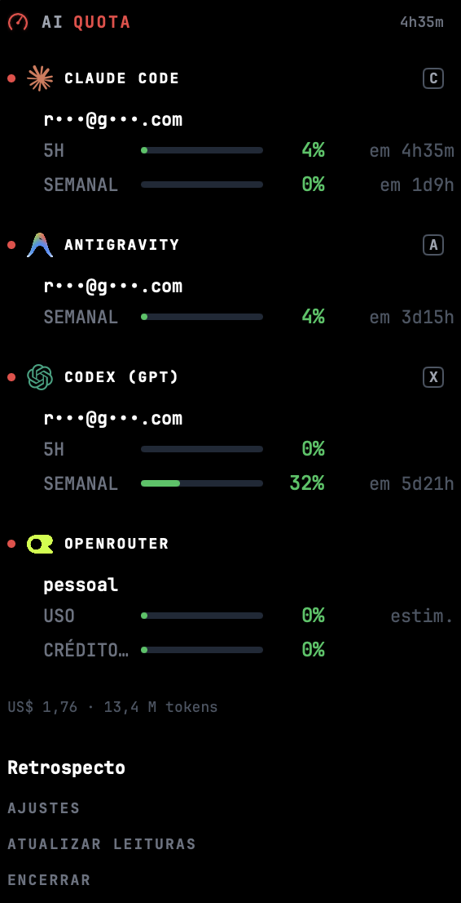

# AI Quota

App de barra de menu do macOS que mostra, por IA, quanto da cota atual já foi usada e quando ela reseta — sem abrir terminal nem entrar no site de cada uma.

Suporta **Claude Code, Codex, Antigravity, Cursor, Grok** e qualquer CLI customizado.

| Arquivo | Sistema | |
|---|---|---|
| `AI-Quota.dmg` | macOS · Apple Silicon (M1 ou mais novo) | [**Baixar**](https://github.com/rafaeldominguesdev/AI-Quota/releases/latest/download/AI-Quota.dmg) |

## O painel

Clicar no ícone da barra de menu abre um painel com uma seção por IA: logo, e-mail mascarado, uma barra por janela de cota (5h, semanal) e uma tecla que abre a página da IA no navegador.

<p align="center">
  
</p>

- A cor da barra segue o nível de uso: verde, âmbar, vermelho.
- **Retrospecto** gera um relatório local (tokens e custo por dia) e abre no navegador.
- Tudo roda localmente: o app lê os logs e configs que cada CLI já grava no disco.

## Instalar

1. Baixe o `.dmg` no botão acima.
2. Arraste "AI Quota" para Aplicativos.
3. Na primeira abertura, o macOS vai bloquear porque o app é assinado localmente (sem conta Apple Developer paga). Clique com o botão direito no ícone → **Abrir** → confirme. Só precisa fazer isso uma vez.
4. O app fica só na barra de menu — não aparece no Dock.

## Compilar a partir do código

Requer apenas o Xcode Command Line Tools e o Swift Package Manager.

```bash
bash scripts/build-app.sh
```

Gera `dist/AI Quota.app`, assinado ad-hoc e pronto para rodar.

## Privacidade

- O app só lê arquivos que já existem no seu disco. Sem telemetria, sem analytics, sem servidor deste projeto.
- **Claude Code**: além do cache local, busca o percentual no endpoint oficial da Anthropic usando o seu próprio token OAuth já salvo na máquina.
- **Antigravity**: roda o seu próprio CLI (`agy`), que se autentica sozinho — o app não lê nenhum token.
- O e-mail exibido aparece sempre mascarado (`r•••@g•••.com`).

## Adicionar outras IAs

Um CLI que o app não conhece, desde que escreva logs em JSONL, entra sem recompilar — edite `~/.config/ai-quota/providers.json` (criado sozinho na primeira execução, com exemplo comentado).

## CLI

O mesmo núcleo roda em linha de comando:

```bash
swift run aiquota-cli              # um bloco por provedor
swift run aiquota-cli --json       # o mesmo, em JSON
swift run aiquota-cli --providers  # lista os provedores detectados
```
